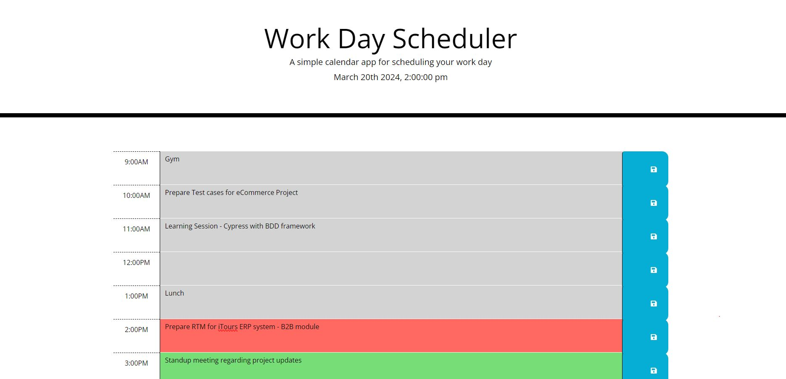

# DailyPlannerApp

## Description
Daily Planner app can be seamlessly integrated into your project to help manage tasks and schedules efficiently.

## Usage
Benefits of Using the Daily Planner App:

- Improved Organization: Keep all tasks and events in one centralized location.
- Enhanced Productivity: Prioritize tasks and allocate time efficiently.
- Reduced Stress: Stay on top of deadlines and commitments with reminders and notifications.
- Increased Accountability: Track progress and hold yourself accountable for completing tasks.

## Review

The URL of the deployed Application: https://shwetatambe0912.github.io/DailyPlannerApp/

